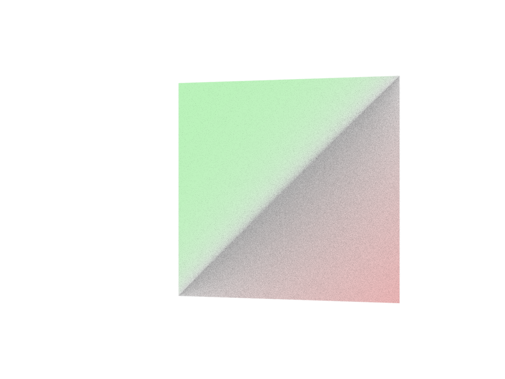

# OSPRay-visualization
This repo contains a collection of example programs that exercises the OSPRay API. The collection is a result of my exploration of the
OSPRay API. It is an archive of my experiments. I started experimenting in order to discover how OSPRay works and become
more familiar with the various controls and parameters available through the API. Most of my previous experience with 
OSPRay has been through use of the renderer in Paraview. While this approach proved adequate for most purposes I suspected
I could do more interesting things with the software by directly utilizing the API. 

> This readme and the source code in the repo are meant to be used as notes and reminders to myself about how the OSPRay API works and how to use it. It is not meant to be a comprehensive guide or to promote the use of OSPRay for any particular purpose. The text herein may contain errors due to my misinterpretation of how OSPRay works. 

My experiments go from basic to more advanced. I initially use the default parameter values for all of the OSPRay objects except where changes 
are necessary to produce an image. The process I followed is to first exercise the instantiation of the geometries available to OSPRay. 
Once I can create all of the geometries I move on to experimenting with other aspects of the API like materials, lights and alternate renderers. 
After the geometries have been explored I move on to volumes and experiment with the functionality for volume rendering. The plan is then to combine the
techniques used in the basic experiments to see what kind of visualizations I can produce with OSPRay.  

The repo has a src directory that contains all the code. The organization of src
sort of follows the API documentation. Each subdirectory of src contains code related to the subsection fo the API documentation,... almost. The organization of this readme follows that of the source directory. Subsections of this doc contain notes about the code in the corresponding source directoy. The code itself contains more detailed comments.  

## Experiments
All the code is C++. I lean on the header provided by the OSPRay developers. So the following includes are found in each application. 
    #include "ospray/ospray_cpp.h"
    #include "ospray/ospray_cpp/ext/rkcommon.h"
    #include "rkcommon/utility/SaveImage.h"
I have built all the experiments with the debug compiler flag. The applications are run from the build/Debug directory. Images created by the applications are written to the build/Debug directory. I copy images from that directory to the Images directory for includion in the readme file. 
The applications write ppm files. I convert the files to png using gimp for convenience. The applications create two images each. The first is the result of a single render pass the second is the result of the accumulation of 10 render passes. I only include the result of the accumulated render in the readme.  
### Hello
This C++ example is the osptutorial example from the OSPRay distro. I used this 
example to set up my development environment. The basic sturcute of the CMake files was developed based on this example. This example renders two triangles with ambient occlusion turned on. It demonstrates the use of the mesh geometry with vertex colors assigned.

*Triangles rendered with AO by hello application*
### Geometry
The src directory name for this collection of examples is actually objects. Geometries are objects but so are lights and other OSPRay "things". 
#### Spheres
This example creates a set of 8 spheres arranged in a cube pattern. Each sphere can have a different radius or the same radius depending on how the src lines are commented out. See comments in the code. The rendered image is pretty pedestrian. There is no shading, only ambient light, white spheres on a gray background. 

*Eight spheres, ambient light, default colors, light gray background*
